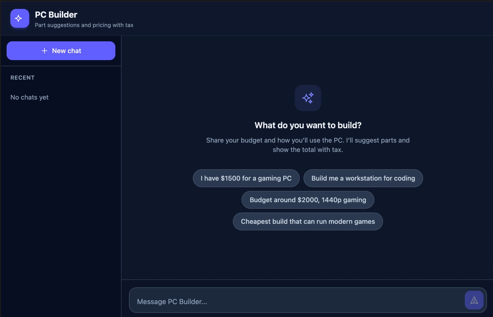

# PC Builder — LangGraph Chatbot

A PC building chatbot with **LangGraph** (state machine + tools), a **database** for parts and chat history, and a **React** frontend. The assistant suggests parts from a curated catalog, computes totals with tax, and persists sessions and builds.



## Architecture

- **Backend**: FastAPI + LangGraph + SQLAlchemy (SQLite). The graph uses an LLM with tools: `search_parts` (DB lookup by category/budget) and `get_build_total` (subtotal + tax by region). Flow is code-defined; no fragile “next state” from the LLM.
- **Database**: `parts`, `sessions`, `messages`, `builds`. Parts are seeded from `data/parts_seed.json` and can be refreshed with a script.
- **Frontend**: Vite + React + TypeScript + Tailwind. Chat UI, session list (previous chats), and build summary card with export.

## Setup

### 1. Environment

In the project root, create a `.env` file with your OpenAI API key:

```bash
OPENAI_API_KEY=your-key-here
```

### 2. Backend

```bash
cd backend
pip install -r requirements.txt
# Seed the parts database (run from backend/)
PYTHONPATH=. python scripts/refresh_parts.py
# Start the API (from backend/)
PYTHONPATH=. uvicorn app.main:app --reload --host 0.0.0.0 --port 8000
```

The API will be at `http://127.0.0.1:8000`. Health: `GET /health`.

### 3. Frontend

```bash
cd frontend
npm install
npm run dev
```

The app will be at `http://localhost:5173` and proxies `/api` to the backend (port 8000).

## Usage

1. Open the frontend; click **New chat** or pick a previous chat.
2. Send a message with your budget and preferences (e.g. “$1500 for gaming, 1440p”).
3. When asked, give your state for tax (e.g. “California” or “CA”).
4. The assistant will use tools to suggest parts and show a build total. The build is saved and shown in the **Build summary** card; you can **Export** it as a text file.

## Project layout

```
backend/
  app/
    main.py         # FastAPI app
    graph/          # LangGraph (state, nodes, graph)
    tools/          # search_parts, get_build_total
    db/             # SQLAlchemy models, CRUD
    api/            # /api/chat, /api/sessions, /api/builds
  scripts/
    refresh_parts.py # Seed/refresh parts from data/parts_seed.json
frontend/
  src/
    components/     # ChatInput, MessageList, BuildCard, SessionList
    api/            # client for backend
data/
  parts_seed.json   # Curated parts (categories, names, prices, links)
_archive/           # Old CLI scripts (do not use; keys redacted)
```